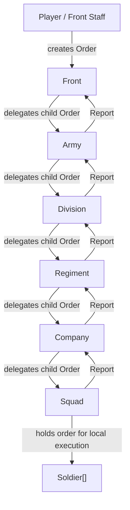

# Foundation Prototype

## Architecture

The first prototype is data-first. It does not contain movement, shooting, maps, UI, combat AI, or rendering.

The project starts from these core concepts:

- **CommandUnit**: a command hierarchy node that can receive orders, delegate them downward, and receive reports upward.
- **Soldier**: an executor inside a Squad. Soldiers do not command subordinates and do not participate in order delegation.
- **UnitState**: a separate object holding combat readiness data for any command unit.
- **Order**: a data object describing intent, target, issuer, priority, status lifecycle, parent order, and future metadata.
- **Report**: a data object describing a message from a lower level to a higher level.
- **EventLog**: a centralized append-only log of domain events for debugging and future AI reasoning.
- **BattleContext**: a future bridge container between strategic and tactical battle layers.

All domain objects are independent from scenes and visuals. Future strategic and tactical maps should reference these objects instead of owning separate unit copies.

## Folder Structure

```text
res://
  Game.tscn
  scripts/
    core/
      game_time.gd
      event_log.gd
    map/
      grid_map.gd          # class CellMap
      cell.gd
      terrain.gd
    strategic/
      strategic_unit.gd
      movement_system.gd
      contact_system.gd
    battle/
      battle_context.gd
    domain/
      command/
        command_unit.gd
        front.gd
        army.gd
        division.gd
        regiment.gd
        company.gd
        squad.gd
      orders/
        order.gd
      personnel/
        soldier.gd
      reports/
        report.gd
      state/
        unit_state.gd
    scenes/
      game.gd
  docs/
    FOUNDATION_PROTOTYPE.md
    TASKS.md
    GAME_VISION.md
```

## Class Structure

```text
Order
  Type: HOLD, DEFEND, ATTACK, RECON, WITHDRAW, ENTRENCH, ASSAULT, SUPPORT, RESUPPLY
  Status: DRAFT, ACTIVE, DELEGATED, COMPLETED, FAILED, CANCELLED

Report
  Type: CONTACT, AMMO_LOW, HEAVY_LOSSES, REQUEST_REINFORCEMENT, ORDER_COMPLETED, ORDER_FAILED, STATUS_UPDATE, SUPPLY_REQUEST
  Severity: INFO, WARNING, URGENT, CRITICAL

UnitState
  strength, ammo, fatigue, morale, combat_effectiveness

CommandUnit
  Front
  Army
  Division
  Regiment
  Company
  Squad
    soldiers: Soldier[]

Soldier
  executor only, not a CommandUnit

BattleContext
  strategic_battle_id, participating_units, strategic_snapshot, tactical_result
```

## Command Chain

```text
Front
 └─ Army
     └─ Division
         └─ Regiment
             └─ Company
                 └─ Squad
                     ├─ Soldier
                     └─ Soldier
```

Order delegation stops at Squad. Soldiers execute locally; they do not delegate orders or receive reports as command nodes.

## Order Lifecycle

Valid transitions:

```text
DRAFT
  ↓
ACTIVE
  ↓
DELEGATED
  ↓
COMPLETED

ACTIVE or DELEGATED may also become FAILED or CANCELLED.
Terminal states: COMPLETED, FAILED, CANCELLED.
```

Leaf command units such as Squad may go `ACTIVE -> COMPLETED` without delegating further.

## Event Log

Centralized events include:

- OrderIssued
- OrderAccepted
- OrderDelegated
- OrderCompleted
- OrderFailed
- OrderCancelled
- ReportCreated
- ReportReceived
- UnitStateChanged
- UnitDestroyed
- BattleContextCreated

## Object Relationship Diagram



## Future Battle Flow

```text
Strategic Battle
  ↓
BattleContext
  ↓
Tactical Battle
  ↓
Result
  ↓
Back to Strategic Layer
```

`BattleContext` currently captures a strategic snapshot and reserves fields for tactical results.

## Test Scenario

`Game.tscn` runs `scripts/scenes/game.gd`.

The scene does the following:

1. Builds a command chain: Front -> Army -> Division -> Regiment -> Company -> Squad with Soldiers inside Squad.
2. Prints the command tree including soldier roster.
3. Creates a HOLD order from the player/front staff.
4. Sends the order to the Front and delegates it downward to Squad.
5. Squad holds the order for local execution because it has no command subordinates.
6. Squad sends CONTACT and AMMO_LOW reports upward.
7. Regiment sends REQUEST_REINFORCEMENT upward.
8. Front receives the reports.
9. Demonstrates UnitState changes and invalid/valid order transitions.
10. Demonstrates UnitDestroyed event when a unit becomes combat ineffective.
11. Creates a BattleContext snapshot for future strategic/tactical linkage.
12. Dumps the EventLog summary.

## Future Extension Points

CommandUnit already contains context dictionaries for future systems:

- strategic_context: campaign, strategic map cell, operational goals.
- tactical_context: tactical map entity links, terrain hints, local battle state.
- supply_context: ammunition, fuel, food, reinforcement, equipment state.

ControlMode exists for future player intervention:

- AI_DELEGATED
- PLAYER_DIRECT
- PLAYER_ASSISTED

These are placeholders for future behavior, not current UI or combat logic.

## Stage 1 — Strategic Layer

Data-first strategic prototype without graphics.

### CellMap

Each cell stores:

- terrain_type
- movement_cost
- supply_modifier
- occupancy (unit ids)

### StrategicUnit

Links a command unit (typically Regiment) to the map:

- position: Vector2i
- destination: Vector2i
- movement_state: IDLE / MOVING
- faction: SOVIET / GERMAN

### GameTime

Tick-based simulation clock:

- seconds_per_tick (game time per tick)
- time_scale for acceleration
- paused flag

### MovementSystem

Simple cell-to-cell movement per tick using terrain movement_cost and unit base_speed. No pathfinding.

### ContactSystem

When opposing units share a cell (or are within contact_radius), creates a BattleContext and logs StrategicContact.

### Stage 1 Demo Flow

```text
Regiment moves on CellMap
  → enemy contact detected
  → EventLog (UnitMoved, StrategicContact, BattleContextCreated)
  → BattleContext ready for Stage 2 tactical battle
```
