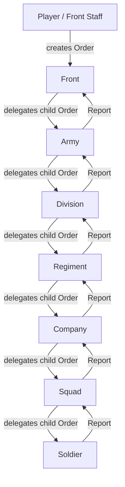

# Foundation Prototype

## Architecture

The first prototype is data-first. It does not contain movement, shooting, maps, UI, combat AI, or rendering.

The project starts from three core concepts:

- CommandUnit: a command hierarchy node that can receive orders, delegate them downward, and receive reports upward.
- Order: a data object describing intent, target, issuer, priority, status, parent order, and future metadata.
- Report: a data object describing a message from a lower level to a higher level.

All domain objects are independent from scenes and visuals. Future strategic and tactical maps should reference these objects instead of owning separate unit copies.

## Folder Structure

```text
res://
  Game.tscn
  scripts/
    domain/
      command/
        command_unit.gd
        front.gd
        army.gd
        division.gd
        regiment.gd
        company.gd
        squad.gd
      orders/
        order.gd
      personnel/
        soldier.gd
      reports/
        report.gd
    scenes/
      game.gd
  docs/
    FOUNDATION_PROTOTYPE.md
  GAME_VISION.md
```

## Class Structure

```text
Order
  Type: HOLD, DEFEND, ATTACK, RECON, WITHDRAW, ENTRENCH, ASSAULT, SUPPORT, RESUPPLY
  Status: DRAFT, ACTIVE, DELEGATED, COMPLETED, FAILED, CANCELLED

Report
  Type: CONTACT, AMMO_LOW, HEAVY_LOSSES, REQUEST_REINFORCEMENT, ORDER_COMPLETED, ORDER_FAILED, STATUS_UPDATE, SUPPLY_REQUEST
  Severity: INFO, WARNING, URGENT, CRITICAL

CommandUnit
  Front
  Army
  Division
  Regiment
  Company
  Squad
  Soldier
```

## Object Relationship Diagram



## Test Scenario

`Game.tscn` runs `scripts/scenes/game.gd`.

The scene does the following:

1. Builds a command chain: Front -> Army -> Division -> Regiment -> Company -> Squad -> Soldier.
2. Prints the command tree.
3. Creates a HOLD order from the player/front staff.
4. Sends the order to the Front.
5. Each level accepts the order and delegates a child order downward.
6. A soldier sends a CONTACT report upward.
7. A squad sends an AMMO_LOW report upward.
8. A regiment sends a REQUEST_REINFORCEMENT report upward.
9. The Front receives the reports.

## Future Extension Points

CommandUnit already contains context dictionaries for future systems:

- strategic_context: campaign, strategic map cell, operational goals.
- tactical_context: tactical map entity links, terrain hints, local battle state.
- supply_context: ammunition, fuel, food, reinforcement, equipment state.

ControlMode exists for future player intervention:

- AI_DELEGATED
- PLAYER_DIRECT
- PLAYER_ASSISTED

These are placeholders for future behavior, not current UI or combat logic.
